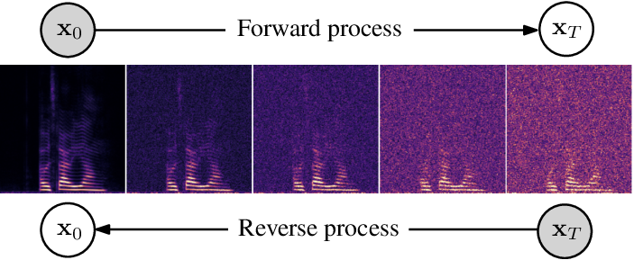

# Amphion Speech Enhancement and Dereverberation with Diffusion-based Generative Models Recipe


<br>
<div align="center">
  
</div>
<br>
This repository contains the PyTorch implementations for the 2023 papers and also adapted from [sgmse](https://github.com/sp-uhh/sgmse):
- Julius Richter, Simon Welker, Jean-Marie Lemercier, Bunlong Lay, Timo Gerkmann. [*"Speech Enhancement and Dereverberation with Diffusion-Based Generative Models"*](https://ieeexplore.ieee.org/abstract/document/10149431), IEEE/ACM Transactions on Audio, Speech, and Language Processing, vol. 31, pp. 2351-2364, 2023.


You can use any sgmse architecture with any dataset you want. There are three steps in total:

1. Data preparation
2. Training
3. Inference


> **NOTE:** You need to run every command of this recipe in the `Amphion` root path:
> ```bash
> cd Amphion
> ```

## 1. Data Preparation

You can train the vocoder with any datasets. Amphion's supported open-source datasets are detailed [here](../../../datasets/README.md).

### Configuration

Specify the dataset path in  `exp_config_base.json`. Note that you can change the `dataset` list to use your preferred datasets.

```json
"dataset": [
    "wsj0reverb"
  ],
  "dataset_path": {
    // TODO: Fill in your dataset path
    "wsj0reverb": ""
  },
"preprocess": {
    "processed_dir": "",
    "sample_rate": 16000
  },
```

## 2. Training

### Configuration

We provide the default hyparameters in the `exp_config_base.json`. They can work on single NVIDIA-24g GPU. You can adjust them based on you GPU machines.

```json
    "train": {
        // TODO: Fill in your checkpoint path
      "checkpoint": "",
      "adam": {
         "lr": 1e-4
      },
      "ddp": false,
      "batch_size": 8,
      "epochs": 200000,
      "save_checkpoints_steps": 800,
      "save_summary_steps": 1000,
      "max_steps": 1000000,
      "ema_decay": 0.999,
      "valid_interval": 800,
       "t_eps": 3e-2,
       "num_eval_files": 20

  }
}
```

### Run

Run the `run.sh` as the training stage (set  `--stage 2`). 

```bash
sh egs/sgmse/dereverberation/run.sh --stage 2
```

> **NOTE:** The `CUDA_VISIBLE_DEVICES` is set as `"0"` in default. You can change it when running `run.sh` by specifying such as `--gpu "0,1,2,3"`.

## 3. Inference

### Run

Run the `run.sh` as the training stage (set  `--stage 3`)

```bash
sh egs/sgmse/dereverberation/run.sh --stage 3 
 --checkpoint_path [your path]
 --test_dir [your path]
 --output_dir  [your path]

```

