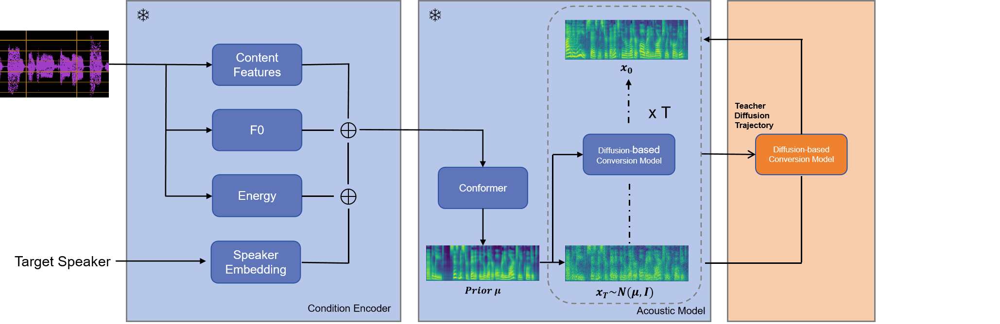

# Accelerating Diffusion-based Singing Voice Conversion through Consistency Distillation
<br>
<div align="center">

</div>
<br>

This is an implement of [Consistency Models](https://arxiv.org/abs/2303.01469) for accelerating diffusion-based singing voice conversion. The overall architecture follows "[Leveraging Diverse Semantic-based Audio Pretrained Models for Singing Voice Conversion](https://arxiv.org/abs/2310.11160)" (2024 IEEE Spoken Language Technology Workshop), only a slightly modification is applied on acoustic model. Specifically,

* The acoustic model is a conformer which generates a coarse spectrogram and a diffusion decoder based on Bidirectional Non-Causal Dilated CNN which polish the former spectrogram for better. This is similar to [CoMoSpeech: One-Step Speech and Singing Voice Synthesis via Consistency Model](https://comospeech.github.io/)
* To accelerate diffusion model, we apply consistency distillation from [Consistency Models](https://arxiv.org/abs/2303.01469). For teacher model, the diffusion schedule of the diffusion decoder follows [karras diffusion](https://arxiv.org/abs/2206.00364). For distilling teacher model, the condition encoder and the conformer part of acoustic model are frozen while the diffusion decoder model is updated via exponential moving average. See Figure above for details.

There are five stages in total:

1. Data preparation
2. Features extraction
3. Teacher Model Training
4. Consistency Distillation
5. Inference/conversion

## 1. Data Preparation

### Dataset Download

By default, we utilize the five datasets for training: M4Singer, Opencpop, OpenSinger, SVCC, and VCTK. How to download them is detailed [here](../../datasets/README.md).

### Configuration

Specify the dataset paths in  `exp_config.json`. Note that you can change the `dataset` list to use your preferred datasets.

```json
    "dataset": [
        "m4singer",
        "opencpop",
        "opensinger",
        "svcc",
        "vctk"
    ],
    "dataset_path": {
        // TODO: Fill in your dataset path
        "m4singer": "[M4Singer dataset path]",
        "opencpop": "[Opencpop dataset path]",
        "opensinger": "[OpenSinger dataset path]",
        "svcc": "[SVCC dataset path]",
        "vctk": "[VCTK dataset path]"
    },
```

## 2. Features Extraction

### Content-based Pretrained Models Download

By default, we utilize the Whisper and ContentVec to extract content features. How to download them is detailed [here](../../../pretrained/README.md).

### Configuration

Specify the dataset path and the output path for saving the processed data and the training model in `exp_config.json`:

```json
    // TODO: Fill in the output log path
    "log_dir": "[Your path to save logs and checkpoints]",
    "preprocess": {
        // TODO: Fill in the output data path
        "processed_dir": "[Your path to save processed data]",
        ...
    },
```

### Run

Run the `run.sh` as the preproces stage (set  `--stage 1`).

```bash
cd Amphion
sh egs/svc/DiffComoSVC/run.sh --stage 1
```

Note: The `CUDA_VISIBLE_DEVICES` is set as `"0"` in default. You can change it when running `run.sh` by specifying such as `--gpu "1"`.

## 3. Teacher Model Training

### Configuration

Set the `distill` in `config/comosvc.json` to `false` for teacher model training, you can also specify the detailed configuration for conformer encoder and diffusion process here: 

```JSON
"comosvc":{
            "distill": false,
            // conformer encoder
            "input_dim": 384,
            "output_dim": 100,
            "n_heads": 2,
            "n_layers": 6,
            "filter_channels":512,
            // karras diffusion
            "P_mean": -1.2,
            "P_std": 1.2,
            "sigma_data": 0.5,
            "sigma_min": 0.002,
            "sigma_max": 80,
            "rho": 7,
            "n_timesteps": 40,
        },
```

We provide the default hyparameters in the `exp_config.json`. They can work on single NVIDIA-24g GPU. You can adjust them based on you GPU machines.

```json
"train": {
        "batch_size": 32,
        ...
        "adamw": {
            "lr": 2.0e-4
        },
        ...
    }
```

### Run

Run the `run.sh` as the training stage (set  `--stage 2`). Specify a experimental name to run the following command. The tensorboard logs and checkpoints will be saved in `[Your path to save logs and checkpoints]/[YourExptName]`.

```bash
cd Amphion
sh egs/svc/DiffComoSVC/run.sh --stage 2 --name [YourExptName]
```

Note: The `CUDA_VISIBLE_DEVICES` is set as `"0"` in default. You can specify it when running `run.sh` such as:

```bash
cd Amphion
sh egs/svc/DiffComoSVC/run.sh --stage 2 --name [YourExptName] --gpu "0,1,2,3"
```

## 4. Consistency Distillation

### Configuration

Set the `distill` in `config/comosvc.json` to `true` for teacher model training, and specify the `teacher_model_path` for consistency distillation. You can also specify the detailed configuration for conformer encoder and diffusion process here: 

```JSON
"model": {
    "teacher_model_path":"[Your_teacher_model_checkpoint].bin",
    ...
    "comosvc":{
                "distill": true,
                // conformer encoder
                "input_dim": 384,
                "output_dim": 100,
                "n_heads": 2,
                "n_layers": 6,
                "filter_channels":512,
                // karras diffusion
                "P_mean": -1.2,
                "P_std": 1.2,
                "sigma_data": 0.5,
                "sigma_min": 0.002,
                "sigma_max": 80,
                "rho": 7,
                "n_timesteps": 40,
            },
```

We provide the default hyparameters in the `exp_config.json`. They can work on single NVIDIA-24g GPU. You can adjust them based on you GPU machines.

```json
"train": {
        "batch_size": 32,
        ...
        "adamw": {
            "lr": 2.0e-4
        },
        ...
    }
```

### Run

Run the `run.sh` as the training stage (set  `--stage 2`). Specify a experimental name to run the following command. The tensorboard logs and checkpoints will be saved in `[Your path to save logs and checkpoints]/[YourExptName]`.

```bash
cd Amphion
sh egs/svc/DiffComoSVC/run.sh --stage 2 --name [YourExptName]
```

Note: The `CUDA_VISIBLE_DEVICES` is set as `"0"` in default. You can specify it when running `run.sh` such as:

```bash
cd Amphion
sh egs/svc/DiffComoSVC/run.sh --stage 2 --name [YourExptName] --gpu "0,1,2,3"
```

## 5. Inference/Conversion

### Pretrained Vocoder Download

We fine-tune the official BigVGAN pretrained model with over 120 hours singing voice data. The benifits of fine-tuning has been investigated in our paper (see this [demo page](https://www.zhangxueyao.com/data/MultipleContentsSVC/vocoder.html)). The final pretrained singing voice vocoder is released [here](../../../pretrained/README.md#amphion-singing-bigvgan) (called `Amphion Singing BigVGAN`).

### Run

For inference/conversion, you need to specify the following configurations when running `run.sh`:

| Parameters                                          | Description                                                  | Example                                                      |
| --------------------------------------------------- | ------------------------------------------------------------ | ------------------------------------------------------------ |
| `--infer_expt_dir`                                  | The experimental directory which contains `checkpoint`       | `[Your path to save logs and checkpoints]/[YourExptName]`    |
| `--infer_output_dir`                                | The output directory to save inferred audios.                | `[Your path to save logs and checkpoints]/[YourExptName]/result` |
| `--infer_source_file` or `--infer_source_audio_dir` | The inference source (can be a json file or a dir).          | The `infer_source_file` could be `[Your path to save processed data]/[YourDataset]/test.json`, and the `infer_source_audio_dir` is a folder which includes several audio files (*.wav, *.mp3 or *.flac). |
| `--infer_target_speaker`                            | The target speaker you want to convert into. You can refer to `[Your path to save logs and checkpoints]/[YourExptName]/singers.json` to choose a trained speaker. | For opencpop dataset, the speaker name would be `opencpop_female1`. |
| `--infer_key_shift`                                 | How many semitones you want to transpose.                    | `"autoshfit"` (by default), `3`, `-3`, etc.                  |

For example, if you want to make `opencpop_female1` sing the songs in the `[Your Audios Folder]`, just run:

```bash
cd Amphion
sh egs/svc/DiffComoSVC/run.sh --stage 3 --gpu "0" \
    --infer_expt_dir [Your path to save logs and checkpoints]/[YourExptName] \
    --infer_output_dir [Your path to save logs and checkpoints]/[YourExptName]/result \
    --infer_source_audio_dir [Your Audios Folder] \
    --infer_target_speaker "opencpop_female1" \
    --infer_key_shift "autoshift"
```
Specially, you can configurate the inference steps for teacher model by setting `inference` at `exp_config`(student model is always one-step sampling):
```json
    "inference": {
        "comosvc": {
            "inference_steps": 40
        }
    }
```

# Reference
https://github.com/zhenye234/CoMoSpeech

https://github.com/openai/consistency_models