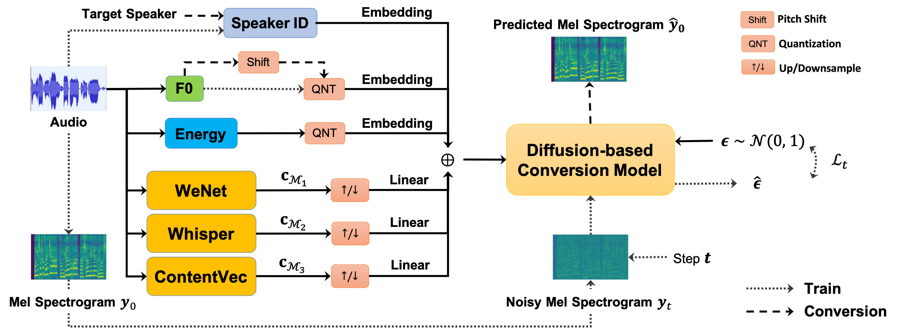

# Leveraging Content-based Features from Multiple Acoustic Models for Singing Voice Conversion

[](https://arxiv.org/abs/2310.11160)
[](https://www.zhangxueyao.com/data/MultipleContentsSVC/index.html)
[](https://huggingface.co/amphion/singing_voice_conversion)
[](https://huggingface.co/spaces/amphion/singing_voice_conversion)
[](https://openxlab.org.cn/apps/detail/Amphion/singing_voice_conversion)

<br>
<div align="center">

</div>
<br>

This is the official implementation of the paper "[Leveraging Diverse Semantic-based Audio Pretrained Models for Singing Voice Conversion](https://arxiv.org/abs/2310.11160)" (2024 IEEE Spoken Language Technology Workshop). Specially,

- The muptile content features are from [Whipser](https://github.com/wenet-e2e/wenet) and [ContentVec](https://github.com/auspicious3000/contentvec).
- The acoustic model is based on Bidirectional Non-Causal Dilated CNN (called `DiffWaveNetSVC` in Amphion), which is similar to [WaveNet](https://arxiv.org/pdf/1609.03499.pdf), [DiffWave](https://openreview.net/forum?id=a-xFK8Ymz5J), and [DiffSVC](https://ieeexplore.ieee.org/document/9688219).
- The vocoder is [BigVGAN](https://github.com/NVIDIA/BigVGAN) architecture and we fine-tuned it in over 120 hours singing voice data.

## A Little Taste Before Getting Started

Before you delve into the code, we suggest exploring the interactive DEMO we've provided for a comprehensive overview. There are several ways you can engage with it:

1. **Online DEMO**
	
	|                         HuggingFace                          |                           OpenXLab                           |
	| :----------------------------------------------------------: | :----------------------------------------------------------: |
	| [](https://huggingface.co/spaces/amphion/singing_voice_conversion)<br />(Worldwide) | [](https://openxlab.org.cn/apps/detail/Amphion/singing_voice_conversion)<br />(Suitable for Mainland China Users) |

2. **Run Local Gradio DEMO**

	|                       Run with Docker                        |               Duplicate Space with Private GPU               |
	| :----------------------------------------------------------: | :----------------------------------------------------------: |
	| [](https://huggingface.co/spaces/amphion/singing_voice_conversion?docker=true) | [](https://huggingface.co/spaces/amphion/singing_voice_conversion?duplicate=true) |

3. **Run with the Extended Colab**

	You can check out [this repo](https://github.com/camenduru/singing-voice-conversion-colab) to run it with Colab. Thanks to [@camenduru](https://x.com/camenduru?s=20) and the community for their support!

## Usage Overview

To train a `DiffWaveNetSVC` model, there are four stages in total:

1. Data preparation
2. Features extraction
3. Training
4. Inference/conversion

> **NOTE:** You need to run every command of this recipe in the `Amphion` root path:
> ```bash
> cd Amphion
> ```

## 1. Data Preparation

### Dataset Download

By default, we utilize the five datasets for training: M4Singer, Opencpop, OpenSinger, SVCC, and VCTK. How to download them is detailed [here](../../datasets/README.md).

### Configuration

Specify the dataset paths in  `exp_config.json`. Note that you can change the `dataset` list to use your preferred datasets.

```json
    "dataset": [
        "m4singer",
        "opencpop",
        "opensinger",
        "svcc",
        "vctk"
    ],
    "dataset_path": {
        // TODO: Fill in your dataset path
        "m4singer": "[M4Singer dataset path]",
        "opencpop": "[Opencpop dataset path]",
        "opensinger": "[OpenSinger dataset path]",
        "svcc": "[SVCC dataset path]",
        "vctk": "[VCTK dataset path]"
    },
```

### Custom Dataset

We support custom dataset, see [here](../../datasets/README.md#customsvcdataset) for the file structure to follow.

After constructing proper file structure, specify your dataset name in `dataset` and its path in `dataset_path`, also add its name in `use_custom_dataset`:

```json
    "dataset": [
        "[Exisiting Dataset Name]",
        //...
        "[Your Custom Dataset Name]"
    ],
    "dataset_path": {
        "[Exisiting Dataset Name]": "[Exisiting Dataset Path]",
        //...
        "[Your Custom Dataset Name]": "[Your Custom Dataset Path]"
    },
    "use_custom_dataset": [
        "[Your Custom Dataset Name]"
    ],
```

> **NOTE:** Custom dataset name does not have to be the same as the folder name. But it needs to satisfy these rules:
> 1. It can not be the same as the exisiting dataset name.
> 2. It can not contain any space or underline(`_`).
> 3. It must be a valid folder name for operating system.
> 
> Some examples of valid custom dataset names are `mydataset`, `myDataset`, `my-dataset`, `mydataset1`, `my-dataset-1`, etc.

## 2. Features Extraction

### Content-based Pretrained Models Download

By default, we utilize the Whisper and ContentVec to extract content features. How to download them is detailed [here](../../../pretrained/README.md).

### Configuration

Specify the dataset path and the output path for saving the processed data and the training model in `exp_config.json`:

```json
    // TODO: Fill in the output log path. The default value is "Amphion/ckpts/svc"
    "log_dir": "ckpts/svc",
    "preprocess": {
        // TODO: Fill in the output data path. The default value is "Amphion/data"
        "processed_dir": "data",
        ...
    },
```

### Run

Run the `run.sh` as the preproces stage (set  `--stage 1`).

```bash
sh egs/svc/MultipleContentsSVC/run.sh --stage 1
```

> **NOTE:** The `CUDA_VISIBLE_DEVICES` is set as `"0"` in default. You can change it when running `run.sh` by specifying such as `--gpu "1"`.

## 3. Training

### Configuration

We provide the default hyparameters in the `exp_config.json`. They can work on single NVIDIA-24g GPU. You can adjust them based on you GPU machines.

```json
"train": {
        "batch_size": 32,
        ...
        "adamw": {
            "lr": 2.0e-4
        },
        ...
    }
```

### Train From Scratch

Run the `run.sh` as the training stage (set  `--stage 2`). Specify a experimental name to run the following command. The tensorboard logs and checkpoints will be saved in `Amphion/ckpts/svc/[YourExptName]`.

```bash
sh egs/svc/MultipleContentsSVC/run.sh --stage 2 --name [YourExptName]
```

### Train From Existing Source

We support training from existing source for various purposes. You can resume training the model from a checkpoint or fine-tune a model from another checkpoint.

Setting `--resume true`, the training will resume from the **latest checkpoint** by default. For example, if you want to resume training from the latest checkpoint in `Amphion/ckpts/svc/[YourExptName]/checkpoint`, run:

```bash
sh egs/svc/MultipleContentsSVC/run.sh --stage 2 --name [YourExptName] \
    --resume true
```

You can choose a **specific checkpoint** for retraining by `--resume_from_ckpt_path` argument. For example, if you want to fine-tune from the checkpoint `Amphion/ckpts/svc/[YourExptName]/checkpoint/[SpecificCheckpoint]`, run:

```bash
sh egs/svc/MultipleContentsSVC/run.sh --stage 2 --name [YourExptName] \
    --resume true
    --resume_from_ckpt_path "Amphion/ckpts/svc/[YourExptName]/checkpoint/[SpecificCheckpoint]" \
```

If you want to **fine-tune from another checkpoint**, just use `--resume_type` and set it to `"finetune"`. For example, If you want to fine-tune from the checkpoint `Amphion/ckpts/svc/[AnotherExperiment]/checkpoint/[SpecificCheckpoint]`, run:

```bash
sh egs/svc/MultipleContentsSVC/run.sh --stage 2 --name [YourExptName] \
    --resume true
    --resume_from_ckpt_path "Amphion/ckpts/svc/[AnotherExperiment]/checkpoint/[SpecificCheckpoint]" \
    --resume_type "finetune"
```

> **NOTE:** The `--resume_type` is set as `"resume"` in default. It's not necessary to specify it when resuming training.
> 
> The difference between `"resume"` and `"finetune"` is that the `"finetune"` will **only** load the pretrained model weights from the checkpoint, while the `"resume"` will load all the training states (including optimizer, scheduler, etc.) from the checkpoint.

Here are some example scenarios to better understand how to use these arguments:
| Scenario | `--resume` | `--resume_from_ckpt_path` | `--resume_type` |
| ------ | -------- | ----------------------- | ------------- |
| You want to train from scratch | no | no | no |
| The machine breaks down during training and you want to resume training from the latest checkpoint | `true` | no | no |
| You find the latest model is overfitting and you want to re-train from the checkpoint before | `true` | `SpecificCheckpoint Path` | no |
| You want to fine-tune a model from another checkpoint | `true` | `SpecificCheckpoint Path` | `"finetune"` |


> **NOTE:** The `CUDA_VISIBLE_DEVICES` is set as `"0"` in default. You can change it when running `run.sh` by specifying such as `--gpu "0,1,2,3"`.

## 4. Inference/Conversion

### Pretrained Vocoder Download

We fine-tune the official BigVGAN pretrained model with over 120 hours singing voice data. The benifits of fine-tuning has been investigated in our paper (see this [demo page](https://www.zhangxueyao.com/data/MultipleContentsSVC/vocoder.html)). The final pretrained singing voice vocoder is released [here](../../../pretrained/README.md#amphion-singing-bigvgan) (called `Amphion Singing BigVGAN`).

### Run

For inference/conversion, you need to specify the following configurations when running `run.sh`:

| Parameters                                          | Description                                                                                                                                | Example                                                                                                                                                                            |
| --------------------------------------------------- | ------------------------------------------------------------------------------------------------------------------------------------------ | ---------------------------------------------------------------------------------------------------------------------------------------------------------------------------------- |
| `--infer_expt_dir`                                  | The experimental directory which contains `checkpoint`                                                                                     | `Amphion/ckpts/svc/[YourExptName]`                                                                                                                                                 |
| `--infer_output_dir`                                | The output directory to save inferred audios.                                                                                              | `Amphion/ckpts/svc/[YourExptName]/result`                                                                                                                                          |
| `--infer_source_file` or `--infer_source_audio_dir` | The inference source (can be a json file or a dir).                                                                                        | The `infer_source_file` could be `Amphion/data/[YourDataset]/test.json`, and the `infer_source_audio_dir` is a folder which includes several audio files (*.wav, *.mp3 or *.flac). |
| `--infer_target_speaker`                            | The target speaker you want to convert into. You can refer to `Amphion/ckpts/svc/[YourExptName]/singers.json` to choose a trained speaker. | For opencpop dataset, the speaker name would be `opencpop_female1`.                                                                                                                |
| `--infer_key_shift`                                 | How many semitones you want to transpose.                                                                                                  | `"autoshfit"` (by default), `3`, `-3`, etc.                                                                                                                                        |

For example, if you want to make `opencpop_female1` sing the songs in the `[Your Audios Folder]`, just run:

```bash
sh egs/svc/MultipleContentsSVC/run.sh --stage 3 --gpu "0" \
	--infer_expt_dir ckpts/svc/[YourExptName] \
	--infer_output_dir ckpts/svc/[YourExptName]/result \
	--infer_source_audio_dir [Your Audios Folder] \
	--infer_target_speaker "opencpop_female1" \
	--infer_key_shift "autoshift"
```

## Citations

```bibtex
@inproceedings{zhang2024leveraging,
    author={Zhang, Xueyao and Fang, Zihao and Gu, Yicheng and Chen, Haopeng and Zou, Lexiao and Zhang, Junan and Xue, Liumeng and Wu, Zhizheng},
    title={Leveraging Diverse Semantic-based Audio Pretrained Models for Singing Voice Conversion},
    booktitle={{IEEE} Spoken Language Technology Workshop, {SLT} 2024},
    year={2024}
}
```
