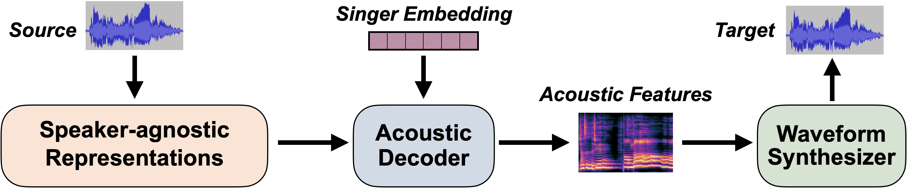

# Amphion Singing Voice Conversion (SVC) Recipe

## Quick Start

We provide a **[beginner recipe](MultipleContentsSVC)** to demonstrate how to train a cutting edge SVC model. Specifically, it is also an official implementation of the paper "[Leveraging Diverse Semantic-based Audio Pretrained Models for Singing Voice Conversion](https://arxiv.org/abs/2310.11160)" (2024 IEEE Spoken Language Technology Workshop). Some demos can be seen [here](https://www.zhangxueyao.com/data/MultipleContentsSVC/index.html).

## Supported Model Architectures

The main idea of SVC is to first disentangle the speaker-agnostic representations from the source audio, and then inject the desired speaker information to synthesize the target, which usually utilizes an acoustic decoder and a subsequent waveform synthesizer (vocoder):

 

  

 

Until now, Amphion SVC has supported the following features and models:

- **Speaker-agnostic Representations**:
  - Content Features: Sourcing from [WeNet](https://github.com/wenet-e2e/wenet), [Whisper](https://github.com/openai/whisper), and [ContentVec](https://github.com/auspicious3000/contentvec).
  - Prosody Features: F0 and energy.
- **Speaker Embeddings**:
  - Speaker Look-Up Table.
  - Reference Encoder (👨‍💻 developing): It can be used for zero-shot SVC.
- **Acoustic Decoders**:
  - Diffusion-based models:
    - **[DiffWaveNetSVC](MultipleContentsSVC)**: The encoder is based on Bidirectional Non-Causal Dilated CNN, which is similar to [WaveNet](https://arxiv.org/pdf/1609.03499.pdf), [DiffWave](https://openreview.net/forum?id=a-xFK8Ymz5J), and [DiffSVC](https://ieeexplore.ieee.org/document/9688219).
    - **[DiffComoSVC](DiffComoSVC)** (👨‍💻 developing): The diffusion framework is based on [Consistency Model](https://proceedings.mlr.press/v202/song23a.html). It can significantly accelerate the inference process of the diffusion model.
  - Transformer-based models:
    - **[TransformerSVC](TransformerSVC)**: Encoder-only and Non-autoregressive Transformer Architecture.
  - VAE- and Flow-based models:
    - **[VitsSVC](VitsSVC)**: It is designed as a [VITS](https://arxiv.org/abs/2106.06103)-like model whose textual input is replaced by the content features, which is similar to [so-vits-svc](https://github.com/svc-develop-team/so-vits-svc).
- **Waveform Synthesizers (Vocoders)**:
  - The supported vocoders can be seen in [Amphion Vocoder Recipe](../vocoder/README.md).
