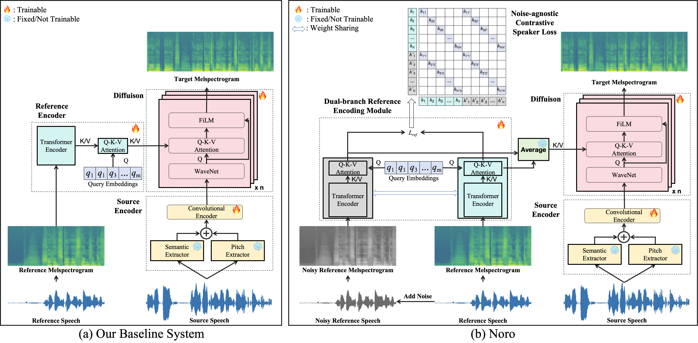

# Noro: A Noise-Robust One-shot Voice Conversion System

<br>
<div align="center">

</div>
<br>

This is the official implementation of the paper: NORO: A Noise-Robust One-Shot Voice Conversion System with Hidden Speaker Representation Capabilities.

- The semantic extractor is from [Hubert](https://github.com/facebookresearch/fairseq/tree/main/examples/hubert).
- The vocoder is [BigVGAN](https://github.com/NVIDIA/BigVGAN) architecture.

## Project Overview
Noro is a noise-robust one-shot voice conversion (VC) system designed to convert the timbre of speech from a source speaker to a target speaker using only a single reference speech sample, while preserving the semantic content of the original speech. Noro introduces innovative components tailored for VC using noisy reference speeches, including a dual-branch reference encoding module and a noise-agnostic contrastive speaker loss.

## Features
- **Noise-Robust Voice Conversion**: Utilizes a dual-branch reference encoding module and noise-agnostic contrastive speaker loss to maintain high-quality voice conversion in noisy environments.
- **One-shot Voice Conversion**: Achieves timbre conversion using only one reference speech sample.
- **Speaker Representation Learning**: Explores the potential of the reference encoder as a self-supervised speaker encoder.

## Installation Requirement

Set up your environment as in Amphion README (you'll need a conda environment, and we recommend using Linux).

### Prepare Hubert Model

Humbert checkpoint and kmeans can be downloaded [here](https://github.com/facebookresearch/fairseq/tree/main/examples/hubert).
Set the downloded model path at `egs/vc/Noro/exp_config_base.json`.


## Usage

### Download pretrained weights
You need to download our pretrained weights from [Google Drive](https://drive.google.com/drive/folders/1NPzSIuSKO8o87g5ImNzpw_BgbhsZaxNg?usp=drive_link). 

### Inference
1. Configure inference parameters:
    Modify the pretrained checkpoint path, source voice path and reference voice path at `egs/vc/Noro/noro_inference.sh` file.
   Currently it's at line 35.
```
    checkpoint_path="path/to/checkpoint/model.safetensors"
    output_dir="path/to/output/directory"
    source_path="path/to/source/audio.wav"
    reference_path="path/to/reference/audio.wav"
```
2. Start inference:
    ```bash
    bash path/to/Amphion/egs/vc/noro_inference.sh
    ```
    
3. You got the reconstructed mel spectrum saved to the output direction.
   Then use the [BigVGAN](https://github.com/NVIDIA/BigVGAN) to construct the wav file. 

## Training from Scratch

### Data Preparation

We use the LibriLight dataset for training and evaluation. You can download it using the following commands:
```bash
    wget https://dl.fbaipublicfiles.com/librilight/data/large.tar
    wget https://dl.fbaipublicfiles.com/librilight/data/medium.tar
    wget https://dl.fbaipublicfiles.com/librilight/data/small.tar
```

### Training the Model with Clean Reference Voice

Configure training parameters:
Our configuration file for training clean Noro model is at "egs/vc/Noro/exp_config_clean.json", and Nosiy Noro model at "egs/vc/Noro/exp_config_noisy.json".

To train your model, you need to modify the `dataset` variable in the json configurations.
Currently it's at line 40, you should modify the "data_dir" to your dataset's root directory.
```
    "directory_list": [
      "path/to/your/training_data_directory1",
      "path/to/your/training_data_directory2",
      "path/to/your/training_data_directory3"
    ],
```

If you want to train for the noisy noro model, you also need to set the direction path for the noisy data at "egs/vc/Noro/exp_config_noisy.json".
```
    "noise_dir": "path/to/your/noise/train/directory",
    "test_noise_dir": "path/to/your/noise/test/directory"
```

You can change other experiment settings in the config flies such as the learning rate, optimizer and the dataset.

  **Set smaller batch_size if you are out of memory😢😢**

I used max_tokens = 3200000 to successfully run on a single card, if you'r out of memory, try smaller.

```json
    "max_tokens": 3200000
```
### Resume from existing checkpoint
Our framework supports resuming from existing checkpoint.
If this is a new experiment, use the following command:
```
CUDA_VISIBLE_DEVICES=$gpu accelerate launch --main_process_port 26667 --mixed_precision fp16 \
"${work_dir}/bins/vc/train.py" \
    --config $exp_config \
    --exp_name $exp_name \
    --log_level debug
```
To resume training or fine-tune from a checkpoint, use the following command:
Ensure the options  `--resume`, `--resume_type resume`, and `--checkpoint_path` are set.

### Run the command to Train model
Start clean training:
    ```bash
    bash path/to/Amphion/egs/vc/noro_train_clean.sh
    ```


Start noisy training:
    ```bash
    bash path/to/Amphion/egs/vc/noro_train_noisy.sh
    ```


