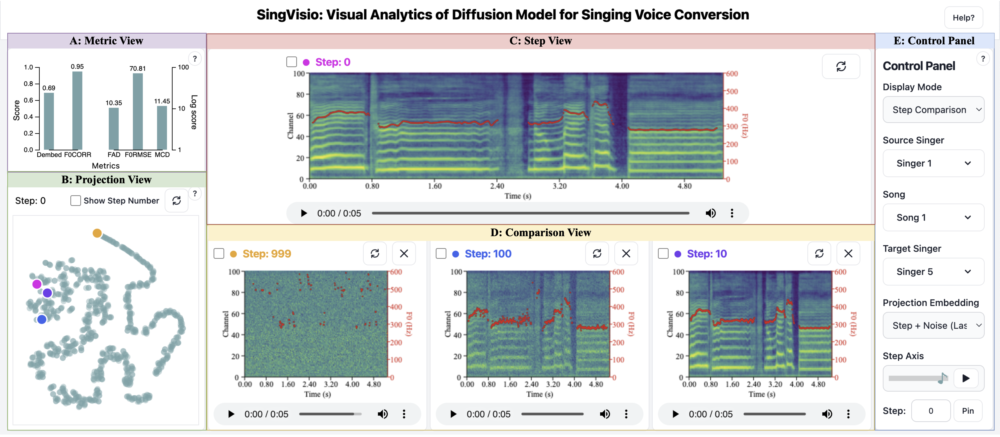

# SingVisio: Visual Analytics of the Diffusion Model for Singing Voice Conversion

This is the official implementation of the paper "[SingVisio: Visual Analytics of the Diffusion Model for Singing Voice Conversion](https://arxiv.org/abs/2402.12660)."  **SingVisio** system can be experienced [here](https://openxlab.org.cn/apps/detail/Amphion/SingVisio). 

**SingVisio** system comprises two main components: a web-based front-end user interface and a back-end generation model.

- The web-based user interface was developed using [D3.js](https://d3-graph-gallery.com/index.html), a JavaScript library designed for creating dynamic and interactive data visualizations. The code can be accessed [here](../../../visualization/SingVisio/webpage/).
- The core generative model, [MultipleContentsSVC](https://arxiv.org/abs/2310.11160), is a diffusion-based model tailored for singing voice conversion (SVC). The code for this model is available in Amphion, with the recipe accessible [here](../../svc/MultipleContentsSVC/).

## Development Workflow for Visualization Systems

The process of developing a visualization system encompasses seven key steps:

1. **Identify the Model for Visualization**: Begin by selecting the model you wish to visualize. 

2. **Task Analysis**: Analyze the specific tasks that the visualization system needs to support through discussions with experts, model builders, and potential users. It means to determine what you want to visualize, such as the classical denoising generation process in diffusion models.

3. **Data and Feature Generation**: Produce the data and features necessary for visualization based on the selected model. Alternatively, you can also generate and visualize them in real time.

4. **Design the User Interface**: Design and develop the user interface to effectively display the model structure, data, and features. 

5. **Iterative Refinement**: Iteratively refine the user interface design for a better visualization experience. 

6. **User Study Preparation**: Design questionnaires for a user study to evaluate the system in terms of system design, functionality, explainability, and user-friendliness.

7. **Evaluation and Improvement**: Conduct comprehensive evaluations through a user study, case study, and expert study to evaluate, analyze, and improve the system.

## Tasks Supported in SingVisio

There are five tasks in **SingVisio** System.
- To investigate the evolution and quality of the converted SVC results from each step in the diffusion generation process, **SingVisio** supports the following two tasks:
    - **T1: Step-wise Diffusion Generation Comparison:** Investigate the evolution and quality of results converted at each step of the diffusion process.
    - **T2: Step-wise Metric Comparison:** Examine changes in metrics throughout the diffusion steps.

- To explore how various factors (content, melody, singer timbre) influence the SVC results, **SingVisio** supports the following three tasks:
    - **T3: Pair-wise SVC Comparison with Different <u>Target Singers</u>**
    - **T4: Pair-wise SVC Comparison with Different <u>Source Singers</u>**
    - **T5: Pair-wise SVC Comparison with Different <u>Songs</u>**

## View Design in SingVisio

The user inference of **SingVisio** is comprised of five views:
- **A: Control Panel:** Enables users to adjust the display mode and select data for visual analysis.
- **B: Step View:** Offers an overview of the diffusion generation process.
- **C: Comparison View:** Facilitates easy comparison of conversion results under different conditions.
- **D: Projection View:** Assists in observing the diffusion steps' trajectory with or without conditions.
- **E: Metric View:** Displays objective metrics evaluated on the diffusion-based SVC model, allowing for interactive examination of metric trends across diffusion steps.

## Detailed System Introduction of SingVisio

For a detailed introduction to **SingVisio** and user instructions, please refer to [this online document](https://x8gvg3n7v3.feishu.cn/docx/IMhUdqIFVo0ZjaxlBf6cpjTEnvf?from=from_copylink) (with animation) or [offline document](../../../visualization/SingVisio/System_Introduction_of_SingVisio.pdf) (without animation).

Additionally, explore the SingVisio demo to see the system's functionalities and usage in action.

[SingVisio_Demo](https://github.com/open-mmlab/Amphion/assets/33707885/0a6e39e8-d5f1-4288-b0f8-32da5a2d6e96)

## User Study of SingVisio

Participate in the [user study](https://www.wjx.cn/vm/wkIH372.aspx#) of **SingVisio** if you're interested. We encourage you to conduct the study after experiencing the **SingVisio** system. Your valuable feedback is greatly appreciated.
