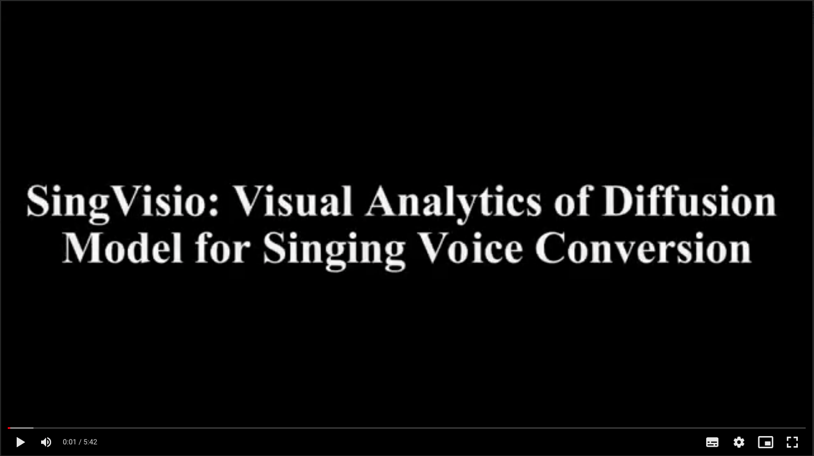

# SingVisio: Visual Analytics of the Diffusion Model for Singing Voice Conversion

This is the official implementation of the paper "[SingVisio: Visual Analytics of the Diffusion Model for Singing Voice Conversion](https://arxiv.org/abs/2402.12660)." Specifically,

- The web-based user interface was developed using [D3.js](https://d3-graph-gallery.com/index.html), a JavaScript library designed for creating dynamic and interactive data visualizations. The code can be accessed [here](../../visualization/SingVisio/webpage/).
- The core generative model, [MultipleContentsSVC](https://arxiv.org/abs/2310.11160), is a diffusion-based model tailored for singing voice conversion (SVC). The code for this model is available in Amphion, with the recipe accessible [here](../../svc/MultipleContentsSVC/).

## Functions of SingVisio

- SingVisio enables to investigate the evolution and quality of the converted SVC results from each step in the diffusion generation process:
    - **T1: Step-wise Diffusion Generation Comparison:** Investigate the evolution and quality of results converted at each step of the diffusion process.
    - **T2: Step-wise Metric Comparison:** Examine changes in metrics throughout the diffusion steps.

- Additionally, it enables exploration of how various factors (content, melody, singer timbre) influence the SVC results:
    - **T3: Pair-wise SVC Comparison with Different <u>Target Singers</u>**
    - **T4: Pair-wise SVC Comparison with Different <u>Source Singers</u>**
    - **T5: Pair-wise SVC Comparison with Different <u>Songs</u>**

## Views in SingVisio

SingVisio is comprised of five views:
- **A: Control Panel:** Enables users to adjust the display mode and select data for visual analysis.
- **B: Step View:** Offers an overview of the diffusion generation process.
- **C: Comparison View:** Facilitates easy comparison of conversion results under different conditions.
- **D: Projection View:** Assists in observing the diffusion steps' trajectory with or without conditions.
- **E: Metric View:** Displays objective metrics evaluated on the diffusion-based SVC model, allowing for interactive examination of metric trends across diffusion steps.

## Detailed System Introduction of SingVisio

For a detailed introduction to SingVisio and user instructions, please refer to [this document](https://x8gvg3n7v3.feishu.cn/docx/IMhUdqIFVo0ZjaxlBf6cpjTEnvf?from=from_copylink). 

Additionally, explore the SingVisio demo to see the system's functionalities and usage in action.

## User Study of SingVisio

Participate in the [user study](https://www.wjx.cn/vm/wkIH372.aspx#) of SingVisio if you're interested. We encourage you to conduct the study after experiencing the SingVisio system. Your valuable feedback is greatly appreciated.
