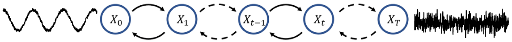

# Amphion Diffusion-based Vocoder Recipe

## Supported Model Architectures

Diffusion-based Vocoders utilize the diffusion process for audio generation, as illustrated below:

<br>
<div align="center">
  
</div>
<br>

Until now, Amphion Diffusion-based Vocoder has supported the following models and training strategies.

- **Models**
    - [DiffWave](https://arxiv.org/pdf/2009.09761)
- **Training and Inference Strategy**
    - [DDPM](https://proceedings.neurips.cc/paper/2020/hash/4c5bcfec8584af0d967f1ab10179ca4b-Abstract.html) 

You can use any vocoder architecture with any dataset you want. There are four steps in total:

1. Data preparation
2. Feature extraction
3. Training
4. Inference

> **NOTE:** You need to run every command of this recipe in the `Amphion` root path:
> ```bash
> cd Amphion
> ```

## 1. Data Preparation

You can train the vocoder with any datasets. Amphion's supported open-source datasets are detailed [here](../../../datasets/README.md).

### Configuration

Specify the dataset path in  `exp_config_base.json`. Note that you can change the `dataset` list to use your preferred datasets.

```json
"dataset": [
    "csd",
    "kising",
    "m4singer",
    "nus48e",
    "opencpop",
    "opensinger",
    "opera",
    "pjs",
    "popbutfy",
    "popcs",
    "ljspeech",
    "vctk",
    "libritts",
],
"dataset_path": {
    // TODO: Fill in your dataset path
    "csd": "[dataset path]",
    "kising": "[dataset path]",
    "m4singer": "[dataset path]",
    "nus48e": "[dataset path]",
    "opencpop": "[dataset path]",
    "opensinger": "[dataset path]",
    "opera": "[dataset path]",
    "pjs": "[dataset path]",
    "popbutfy": "[dataset path]",
    "popcs": "[dataset path]",
    "ljspeech": "[dataset path]",
    "vctk": "[dataset path]",
    "libritts": "[dataset path]",
},
```

### 2. Feature Extraction

The needed features are speficied in the individual vocoder direction so it doesn't require any modification.

### Configuration

Specify the dataset path and the output path for saving the processed data and the training model in `exp_config_base.json`:

```json
    // TODO: Fill in the output log path. The default value is "Amphion/ckpts/vocoder"
    "log_dir": "ckpts/vocoder",
    "preprocess": {
        // TODO: Fill in the output data path. The default value is "Amphion/data"
        "processed_dir": "data",
        ...
    },
```

### Run

Run the `run.sh` as the preproces stage (set  `--stage 1`).

```bash
sh egs/vocoder/diffusion/{vocoder_name}/run.sh --stage 1
```

> **NOTE:** The `CUDA_VISIBLE_DEVICES` is set as `"0"` in default. You can change it when running `run.sh` by specifying such as `--gpu "1"`.

## 3. Training

### Configuration

We provide the default hyparameters in the `exp_config_base.json`. They can work on single NVIDIA-24g GPU. You can adjust them based on you GPU machines.

```json
"train": {
    "batch_size": 32,
    "max_epoch": 1000000,
    "save_checkpoint_stride": [20],
    "adamw": {
        "lr": 2.0e-4,
        "adam_b1": 0.8,
        "adam_b2": 0.99
    },
    "exponential_lr": {
        "lr_decay": 0.999
    },
}
```

### Run

Run the `run.sh` as the training stage (set  `--stage 2`). Specify a experimental name to run the following command. The tensorboard logs and checkpoints will be saved in `Amphion/ckpts/vocoder/[YourExptName]`.

```bash
sh egs/vocoder/diffusion/{vocoder_name}/run.sh --stage 2 --name [YourExptName]
```

> **NOTE:** The `CUDA_VISIBLE_DEVICES` is set as `"0"` in default. You can change it when running `run.sh` by specifying such as `--gpu "0,1,2,3"`.

If you want to resume or finetune from a pretrained model, run:

```bash
sh egs/vocoder/diffusion/{vocoder_name}/run.sh --stage 2 \
	--name [YourExptName] \
	--resume_type ["resume" for resuming training and "finetune" for loading parameters only] \
	--checkpoint Amphion/ckpts/vocoder/[YourExptName]/checkpoint \
```

> **NOTE:** For multi-gpu training, the `main_process_port` is set as `29500` in default. You can change it when running `run.sh` by specifying such as `--main_process_port 29501`.

## 4. Inference

### Run

Run the `run.sh` as the training stage (set  `--stage 3`), we provide three different inference modes, including `infer_from_dataset`, `infer_from_feature`, `and infer_from_audio`. 

```bash
sh egs/vocoder/diffusion/{vocoder_name}/run.sh --stage 3 \
	--infer_mode [Your chosen inference mode] \
	--infer_datasets [Datasets you want to inference, needed when infer_from_dataset] \
	--infer_feature_dir [Your path to your predicted acoustic features, needed when infer_from_feature] \
	--infer_audio_dir [Your path to your audio files, needed when infer_form_audio] \
	--infer_expt_dir Amphion/ckpts/vocoder/[YourExptName] \
	--infer_output_dir Amphion/ckpts/vocoder/[YourExptName]/result \
```

#### a. Inference from Dataset

Run the `run.sh` with specified datasets, here is an example.

```bash
sh egs/vocoder/diffusion/{vocoder_name}/run.sh --stage 3 \
	--infer_mode infer_from_dataset \
	--infer_datasets "libritts vctk ljspeech" \
	--infer_expt_dir Amphion/ckpts/vocoder/[YourExptName] \
	--infer_output_dir Amphion/ckpts/vocoder/[YourExptName]/result \
```

#### b. Inference from Features

If you want to inference from your generated acoustic features, you should first prepare your acoustic features into the following structure:

```plaintext
 ┣ {infer_feature_dir}
 ┃ ┣ mels
 ┃ ┃ ┣ sample1.npy
 ┃ ┃ ┣ sample2.npy
```

Then run the `run.sh` with specificed folder direction, here is an example.

```bash
sh egs/vocoder/diffusion/{vocoder_name}/run.sh --stage 3 \
	--infer_mode infer_from_feature \
	--infer_feature_dir [Your path to your predicted acoustic features] \
	--infer_expt_dir Amphion/ckpts/vocoder/[YourExptName] \
	--infer_output_dir Amphion/ckpts/vocoder/[YourExptName]/result \
```

#### c. Inference from Audios

If you want to inference from audios for quick analysis synthesis, you should first prepare your audios into the following structure:

```plaintext
 ┣ audios
 ┃ ┣ sample1.wav
 ┃ ┣ sample2.wav
```

Then run the `run.sh` with specificed folder direction, here is an example.

```bash
sh egs/vocoder/diffusion/{vocoder_name}/run.sh --stage 3 \
	--infer_mode infer_from_audio \
	--infer_audio_dir [Your path to your audio files] \
	--infer_expt_dir Amphion/ckpts/vocoder/[YourExptName] \
	--infer_output_dir Amphion/ckpts/vocoder/[YourExptName]/result \
```
