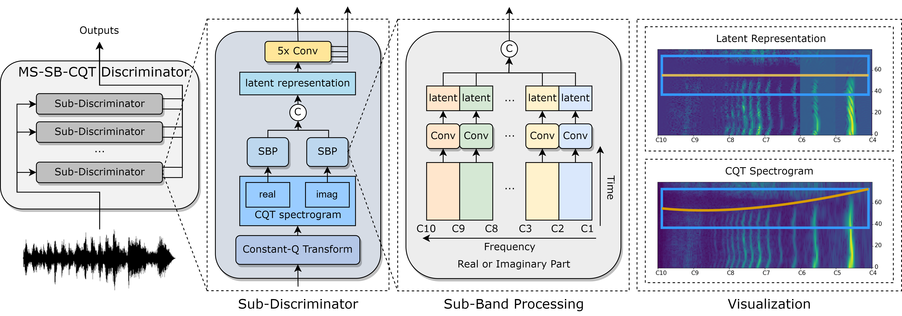

# Multi-Scale Sub-Band Constant-Q Transform Discriminator for High-Fedility Vocoder

[](https://arxiv.org/abs/2311.14957)
[](https://vocodexelysium.github.io/MS-SB-CQTD/)
[](https://huggingface.co/amphion/hifigan_speech_bigdata)

<br>
<div align="center">

</div>
<br>

This is the official implementation of the paper "[Multi-Scale Sub-Band Constant-Q Transform Discriminator for High-Fidelity Vocoder](https://arxiv.org/abs/2311.14957)". In this recipe, we will illustrate how to train a high quality HiFi-GAN on LibriTTS, VCTK and LJSpeech via utilizing multiple Time-Frequency-Representation-based Discriminators.

There are four stages in total:

1. Data preparation
2. Feature extraction
3. Training
4. Inference

> **NOTE:** You need to run every command of this recipe in the `Amphion` root path:
> ```bash
> cd Amphion
> ```

## 1. Data Preparation

### Dataset Download

By default, we utilize the three datasets for training: LibriTTS, VCTK and LJSpeech. How to download them is detailed in [here](../../../datasets/README.md).

### Configuration

Specify the dataset path in  `exp_config.json`. Note that you can change the `dataset` list to use your preferred datasets.

```json
"dataset": [
    "ljspeech",
    "vctk",
    "libritts",
],
"dataset_path": {
    // TODO: Fill in your dataset path
    "ljspeech": "[LJSpeech dataset path]",
    "vctk": "[VCTK dataset path]",
    "libritts": "[LibriTTS dataset path]",
},
```

## 2. Features Extraction

For HiFiGAN, only the Mel-Spectrogram and the Output Audio are needed for training.

### Configuration

Specify the dataset path and the output path for saving the processed data and the training model in `exp_config.json`:

```json
    // TODO: Fill in the output log path. The default value is "Amphion/ckpts/vocoder"
    "log_dir": "ckpts/vocoder",
    "preprocess": {
        // TODO: Fill in the output data path. The default value is "Amphion/data"
        "processed_dir": "data",
        ...
    },
```

### Run

Run the `run.sh` as the preproces stage (set  `--stage 1`).

```bash
sh egs/vocoder/gan/tfr_enhanced_hifigan/run.sh --stage 1
```

> **NOTE:** The `CUDA_VISIBLE_DEVICES` is set as `"0"` in default. You can change it when running `run.sh` by specifying such as `--gpu "1"`.

## 3. Training

### Configuration

We provide the default hyparameters in the `exp_config.json`. They can work on single NVIDIA-24g GPU. You can adjust them based on you GPU machines.

```json
"train": {
    "batch_size": 32,
    ...
}
```

### Run

Run the `run.sh` as the training stage (set  `--stage 2`). Specify a experimental name to run the following command. The tensorboard logs and checkpoints will be saved in `Amphion/ckpts/vocoder/[YourExptName]`.

```bash
sh egs/vocoder/gan/tfr_enhanced_hifigan/run.sh --stage 2 --name [YourExptName]
```

> **NOTE:** The `CUDA_VISIBLE_DEVICES` is set as `"0"` in default. You can change it when running `run.sh` by specifying such as `--gpu "0,1,2,3"`.

If you want to resume or finetune from a pretrained model, run:

```bash
sh egs/vocoder/gan/tfr_enhanced_hifigan/run.sh --stage 2 \
	--name [YourExptName] \
	--resume_type ["resume" for resuming training and "finetune" for loading parameters only] \
	--checkpoint Amphion/ckpts/vocoder/[YourExptName]/checkpoint \
```

> **NOTE:** For multi-gpu training, the `main_process_port` is set as `29500` in default. You can change it when running `run.sh` by specifying such as `--main_process_port 29501`.

## 4. Inference

### Pretrained Vocoder Download

We trained a HiFiGAN checkpoint with around 685 hours Speech data. The final pretrained checkpoint is released [here](../../../../pretrained/hifigan/README.md).

### Run

Run the `run.sh` as the training stage (set  `--stage 3`), we provide three different inference modes, including `infer_from_dataset`, `infer_from_feature`, `and infer_from audio`. 

```bash
sh egs/vocoder/gan/tfr_enhanced_hifigan/run.sh --stage 3 \
	--infer_mode [Your chosen inference mode] \
	--infer_datasets [Datasets you want to inference, needed when infer_from_dataset] \
	--infer_feature_dir [Your path to your predicted acoustic features, needed when infer_from_feature] \
	--infer_audio_dir [Your path to your audio files, needed when infer_form_audio] \
	--infer_expt_dir Amphion/ckpts/vocoder/[YourExptName] \
	--infer_output_dir Amphion/ckpts/vocoder/[YourExptName]/result \
```

#### a. Inference from Dataset

Run the `run.sh` with specified datasets, here is an example.

```bash
sh egs/vocoder/gan/tfr_enhanced_hifigan/run.sh --stage 3 \
	--infer_mode infer_from_dataset \
	--infer_datasets "libritts vctk ljspeech" \
	--infer_expt_dir Amphion/ckpts/vocoder/[YourExptName] \
	--infer_output_dir Amphion/ckpts/vocoder/[YourExptName]/result \
```

#### b. Inference from Features

If you want to inference from your generated acoustic features, you should first prepare your acoustic features into the following structure:

```plaintext
 ┣ {infer_feature_dir}
 ┃ ┣ mels
 ┃ ┃ ┣ sample1.npy
 ┃ ┃ ┣ sample2.npy
```

Then run the `run.sh` with specificed folder direction, here is an example.

```bash
sh egs/vocoder/gan/tfr_enhanced_hifigan/run.sh --stage 3 \
	--infer_mode infer_from_feature \
	--infer_feature_dir [Your path to your predicted acoustic features] \
	--infer_expt_dir Amphion/ckpts/vocoder/[YourExptName] \
	--infer_output_dir Amphion/ckpts/vocoder/[YourExptName]/result \
```

#### c. Inference from Audios

If you want to inference from audios for quick analysis synthesis, you should first prepare your audios into the following structure:

```plaintext
 ┣ audios
 ┃ ┣ sample1.wav
 ┃ ┣ sample2.wav
```

Then run the `run.sh` with specificed folder direction, here is an example.

```bash
sh egs/vocoder/gan/tfr_enhanced_hifigan/run.sh --stage 3 \
	--infer_mode infer_from_audio \
	--infer_audio_dir [Your path to your audio files] \
	--infer_expt_dir Amphion/ckpts/vocoder/[YourExptName] \
	--infer_output_dir Amphion/ckpts/vocoder/[YourExptName]/result \
```

## Citations

```bibtex
@misc{gu2023cqt,
      title={Multi-Scale Sub-Band Constant-Q Transform Discriminator for High-Fidelity Vocoder}, 
      author={Yicheng Gu and Xueyao Zhang and Liumeng Xue and Zhizheng Wu},
      year={2023},
      eprint={2311.14957},
      archivePrefix={arXiv},
      primaryClass={cs.SD}
}
```