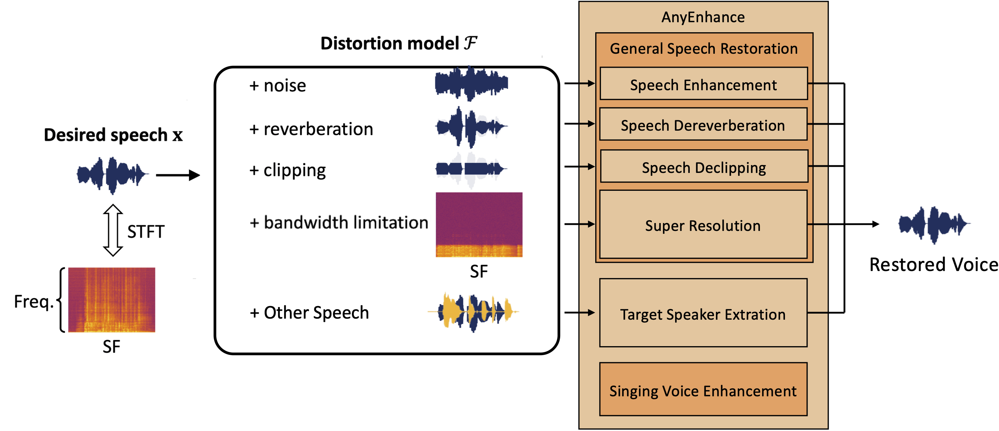
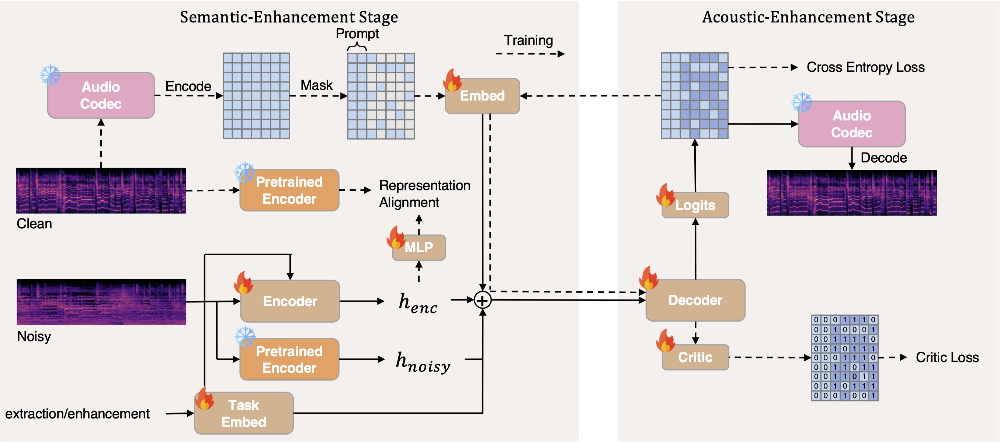
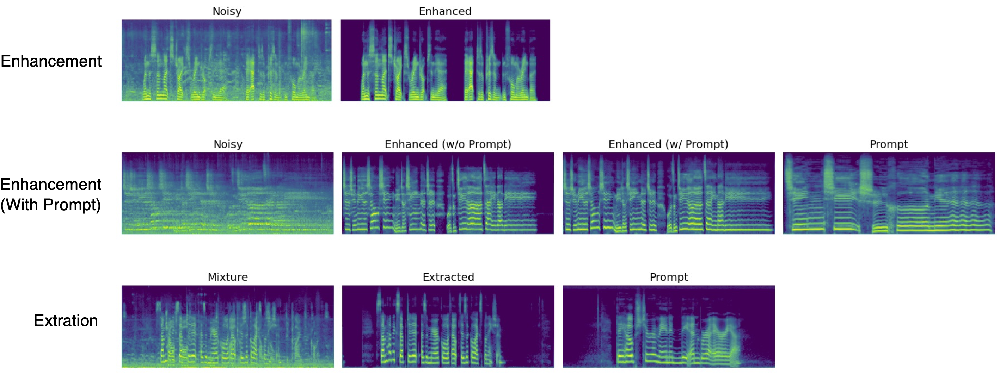

# AnyEnhance: A Unified Generative Model with Prompt-Guidance and Self-Critic for Voice Enhancement and Extraction

[](https://huggingface.co/amphion/anyenhance)

<br>
<div align="center">

</div>
<br>

*Image adapted from [urgent challenge](https://urgent-challenge.github.io/urgent2024/baseline/).

We present AnyEnhance, a unified model for both voice enhancement and extraction. Based on a masked generative model, AnyEnhance is capable of addressing diverse speech \& singing voice front-end tasks, including denoising, dereverberation, declipping, super-resolution, and target speaker extraction.

<br>
<div align="center">

</div>
<br>

## Preparation

### 1. Clone the repository

```bash
git clone https://github.com/open-mmlab/Amphion.git
cd Amphion
```

### 2. Install the environment

Before start installing, making sure you are under the `Amphion` directory. If not, use `cd` to enter.

```bash
# root_dir: Amphion
cd models/se/anyenhance
conda create -n anyenhance python=3.10
conda activate anyenhance
pip install -r requirements.txt
```

### 3. Download the pretrained models

```bash
# root_dir: Amphion
# Uncomment to use HuggingFace mirror for mainland China users
# export HF_ENDPOINT=https://hf-mirror.com
cd models/se/anyenhance
mkdir pretrained
# Download the w2v-bert-2.0
huggingface-cli download facebook/w2v-bert-2.0 --local-dir ./pretrained/w2v-bert-2.0
# Download anyenhance weights
huggingface-cli download amphion/anyenhance --local-dir ./pretrained/anyenhance
```

## Inference Examples

### Enhancement without Prompt

```bash
# root_dir: Amphion
python -m models.se.anyenhance.infer_anyenhance \
    --task_type "enhancement" \
    --input_file models/se/anyenhance/wav/enhancement/p226_006.wav \
    --output_folder models/se/anyenhance/wav/enhanced \
    --device cuda:0
```

### Enhancement with Prompt

```bash
# root_dir: Amphion
python -m models.se.anyenhance.infer_anyenhance \
    --task_type "enhancement" \
    --input_file models/se/anyenhance/wav/enhancement/13-noisy.wav \
    --prompt_file models/se/anyenhance/wav/enhancement/13-prompt.wav \
    --output_folder models/se/anyenhance/wav/enhanced \
    --device cuda:0
```

### Extraction

```bash
# root_dir: Amphion
python -m models.se.anyenhance.infer_anyenhance \
    --task_type "extraction" \
    --input_file models/se/anyenhance/wav/extraction/9-noisy.wav \
    --prompt_file models/se/anyenhance/wav/extraction/9-prompt.wav \
    --output_folder models/se/anyenhance/wav/enhanced \
    --device cuda:0
```

## Visualization Examples

<br>
<div align="center">

</div>
<br>


## Citations

If you use AnyEnhance in your research, please cite the following papers:

```bibtex
@inproceedings{amphion,
    author={Zhang, Xueyao and Xue, Liumeng and Gu, Yicheng and Wang, Yuancheng and Li, Jiaqi and He, Haorui and Wang, Chaoren and Song, Ting and Chen, Xi and Fang, Zihao and Chen, Haopeng and Zhang, Junan and Tang, Tze Ying and Zou, Lexiao and Wang, Mingxuan and Han, Jun and Chen, Kai and Li, Haizhou and Wu, Zhizheng},
    title={Amphion: An Open-Source Audio, Music and Speech Generation Toolkit},
    booktitle={{IEEE} Spoken Language Technology Workshop, {SLT} 2024},
    year={2024}
}
```