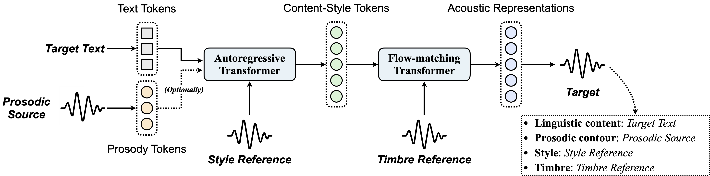

# Vevo1.5

[](https://veiled-army-9c5.notion.site/Vevo1-5-1d2ce17b49a280b5b444d3fa2300c93a)
[](https://huggingface.co/amphion/VevoSing)
[](https://versavoice.github.io/)

We present **Vevo1.5**, a versatile zero-shot voice imitation framework capable of modeling both speech and singing voices. This framework offers two key features: 

1. Unified speech and singing voice modeling.
2. Controllability for multiple voice attributes, including text, prosody, style, and timbre. 



For a hands-on demonstration of Vevo1.5's capabilities, we invite readers to explore [our accompanying blog post](https://veiled-army-9c5.notion.site/Vevo1-5-1d2ce17b49a280b5b444d3fa2300c93a).

## Pre-trained Models

We have included the following pre-trained models at Amphion:

| Model                           | Description                                                                                                                                                                                                                                                           | Pre-trained Data and Checkpoint                                                                                                                                                                                                                           |
| ------------------------------- | --------------------------------------------------------------------------------------------------------------------------------------------------------------------------------------------------------------------------------------------------------------------- | --------------------------------------------------------------------------------------------------------------------------------------------------------------------------------------------------------------------------------------------------------- |
| **Prosody Tokenizer**           | Converting speech/singing waveform to **coarse-grained prosody tokens** (which is also be interpreted as *melody contour* from a musical perspective). It is a single codebook VQ-VAE with a vocabulary size of 512. The frame rate is 6.25 Hz. (i.e., **56.25 bps**) | [🤗 Emilia-101k, Sing-0.4k](https://huggingface.co/amphion/Vevo1.5/tree/main/tokenizer/prosody_fvq512_6.25hz)                                                                                                                                              |
| **Content-Style Tokenizer**     | Converting speech/singing waveform to **fine-grained content-style tokens**. It is a single codebook VQ-VAE with a vocabulary size of 16384. The frame rate is 12.5 Hz. (i.e., **175 bps**)                                                                           | [🤗 Emilia-101k, Sing-0.4k](https://huggingface.co/amphion/Vevo1.5/tree/main/tokenizer/contentstyle_fvq16384_12.5hz)                                                                                                                                       |
| **Auto-regressive Transformer** | Predicting content-style tokens from phone tokens (and optionally, prosody tokens) with an auto-regressive transformer (780M).                                                                                                                                        | [🤗 Emilia-101k, Sing-0.4k](https://huggingface.co/amphion/Vevo1.5/tree/main/contentstyle_modeling/ar_emilia101k_sing0.4k) <br>[🤗 Emilia-101k, SingNet-7k](https://huggingface.co/amphion/Vevo1.5/tree/main/contentstyle_modeling/ar_emilia101k_singnet7k) |
| **Flow-matching Transformer**   | Predicting mel-spectrogram from content-style tokens with a flow-matching transformer (350M).                                                                                                                                                                         | [🤗 Emilia-101k, Sing-0.4k](https://huggingface.co/amphion/Vevo1.5/tree/main/acoustic_modeling/fm_emilia101k_sing0.4k) <br> [🤗 Emilia-101k, SingNet-7k](https://huggingface.co/amphion/Vevo1.5/tree/main/acoustic_modeling/fm_emilia101k_singnet7k)        |
| **Vocoder**                     | Predicting audio from mel-spectrogram with a Vocos-based vocoder (250M).                                                                                                                                                                                              | [🤗 Emilia-101k](https://huggingface.co/amphion/Vevo/tree/main/acoustic_modeling/Vocoder) <br>[🤗 Emilia-101k, SingNet-3k](https://huggingface.co/amphion/Vevo1.5/tree/main/acoustic_modeling/Vocoder)                                                      |

The training data includes:

- **Emilia-101k**: about 101k hours of speech data

- **Sing-0.4k**: about 400 hours of open-source singing voice data as follows: 

  | Dataset Name | \#Hours   |
  | ------------ | --------- |
  | ACESinger    | 320.6     |
  | OpenSinger   | 45.7      |
  | M4Singer     | 28.4      |
  | Popbutfy     | 23.8      |
  | PopCS        | 11.5      |
  | Opencpop     | 5.1       |
  | CSD          | 3.8       |
  | **Total**    | **438.9** |

- **SingNet-7k**: about 7,000 hours of internal singing voice data, preprocessed using the [SingNet pipeline](https://openreview.net/pdf?id=X6ffdf6nh3). The SingNet-3k is a 3000-hour subset of SingNet-7k.

## Quickstart (Inference Only)

To infer with Vevo1.5, you need to follow the steps below:

1. Clone the repository and install the environment. 
2. Run the inference script.

> **Note:** Same environment requirement as MaskGCT/Vevo.

### Clone and Environment Setup

#### 1. Clone the repository

```bash
git clone https://github.com/open-mmlab/Amphion.git
cd Amphion
```

#### 2. Install the environment

Before start installing, making sure you are under the `Amphion` directory. If not, use `cd` to enter.

Since we use `phonemizer` to convert text to phoneme, you need to install `espeak-ng` first. More details can be found [here](https://bootphon.github.io/phonemizer/install.html). Choose the correct installation command according to your operating system:

```bash
# For Debian-like distribution (e.g. Ubuntu, Mint, etc.)
sudo apt-get install espeak-ng
# For RedHat-like distribution (e.g. CentOS, Fedora, etc.) 
sudo yum install espeak-ng
```

Now, we are going to install the environment. It is recommended to use conda to configure:

```bash
conda create -n vevo python=3.10
conda activate vevo

pip install -r models/vc/vevo/requirements.txt
```

### Inference Script

```sh
# FM model only (i.e., timbre control. Usually for VC and SVC)
python -m models.svc.vevosing.infer_vevosing_fm

# AR + FM (i.e., text, prosody, and style control)
python -m models.svc.vevosing.infer_vevosing_ar
```

Running this will automatically download the pretrained model from HuggingFace and start the inference process. The generated audios are saved in `models/svc/vevosing/output/*.wav` by default.

## Training Recipe

For advanced users, we provide the following training recipe:

### Data preparation

#### Emilia

1. Please download the dataset following the official instructions provided by [Emilia](https://huggingface.co/datasets/amphion/Emilia-Dataset).

2. Due to Emilia's substantial storage requirements, data loading logic may vary slightly depending on storage configuration. We provide a reference implementation for local disk loading [in this file](../../base/emilia_dataset.py). After downloading the Emilia dataset, please adapt the data loading logic accordingly. In most cases, only modifying the paths specified in [Lines 36-37](../../base/emilia_dataset.py#L36) should be sufficient: 

   ```python
   MNT_PATH = "[Please fill out your emilia data root path]"
   CACHE_PATH = "[Please fill out your emilia cache path]"
   ```

#### SingNet

Due to copyright restrictions, we are unable to release specific singing voice datasets. We assume users have pre-processed vocal track data (e.g., Sing-0.4k) available. Please prepare a JSON metadata file with the following structure to track your dataset:

```json
[
    {
        "Path": "[Please fill out your data root]/2020-ISMIR-CSD/english/wav/en048b/en048b#6.wav",
        "Duration": 29.94,
        "Text": " They sing along Look out the window, look out the window Singing the winter song Out there where the snowman stands Only I can see Children run to shake his hands For when the sun shines he'll be gone Hurry, hurry, see the flurry",
        "Language": "en" // Supported: "en", "zh", "ja", "ko", "fr", and "de"
    },
    ...
]
```

The JSON metadata file should contain the following fields for each audio sample:

- **Path**: Absolute path to the audio file	
- **Duration**: The duration of the audio file
- **Text**: Transcript content (typically song lyrics) of the audio file
- **Language**: Language code of the transcription. Supported: `en`, `zh`, `ja`, `ko`, `fr`, `de`.

### Launch Training

Train the prosody tokenizer, the content-style tokenizer, the auto-regressive model, the flow-matching model, and the vocoder respectively:

> **Note**: You need to run the following commands under the `Amphion` root path:
> ```
> git clone https://github.com/open-mmlab/Amphion.git
> cd Amphion
> ```

#### Prosody Tokenizer

Specify the singing metadata file path in the `egs/codec/coco/prosody_fvq512_6.25hz.json`:

```json
{
    ...
    "singnet_path": "[Please fill out your singing data path]/sing400.json",
    ...
}
```

Run the following script:

```bash
sh egs/codec/coco/prosody_fvq512_6.25hz.sh
```

#### Content-Style Tokenizer

Specify the singing metadata file path in the `egs/codec/coco/contentstyle_fvq16384_12.5hz.json`:

```json
{
    ...
    "singnet_path": "[Please fill out your singing data path]/sing400.json",
    ...
}
```

Run the following script:

```bash
sh egs/codec/coco/contentstyle_fvq16384_12.5hz.sh
```

#### Auto-regressive Transformer

Specify (1) the singing metadata file path, and (2) the pre-trained prosody and content-style tokenizer paths, in the `egs/svc/AutoregressiveTransformer/ar_synthesis.json`:

```json
{
    ...
    "singnet_path": "[Please fill out your singing data path]/sing400.json",
    ...
    "model": {
        ...
        "coco_style": {
            ...
            "pretrained_path": "[Please fill out your pretrained model path]/model.safetensors" // The pre-trained prosody tokenizer
        },
        "coco_content_style": {
            ...
            "pretrained_path": "[Please fill out your pretrained model path]/model.safetensors" // The pre-trained content-style tokenizer
        },
        ...
    },
    ...
}
```

Run the following script:

```bash
sh egs/svc/AutoregressiveTransformer/ar_synthesis.sh
```

#### Flow-matching Transformer

Specify (1) the singing metadata file path, and (2) the pre-trained content-style tokenizer path, in the `egs/svc/FlowMatchingTransformer/fm_contentstyle.json`:

```json
{
    ...
    "singnet_path": "[Please fill out your singing data path]/sing400.json",
    ...
    "model": {
        "coco": {
            "pretrained_path": "[Please fill out your pretrained model path]/model.safetensors" // The pre-trained content-style tokenizer
        },
    },
    ...
}
```

Run the following script:

```bash
sh egs/svc/FlowMatchingTransformer/fm_contentstyle.sh
```

#### Vocoder

Specify the singing metadata file path in the `egs/vocoder/vocos/emilia_singnet.json`:

```json
{
    ...
    "singnet_path": "[Please fill out your singing data path]/sing400.json",
    ...
}
```

Run the following script:

```bash
sh egs/vocoder/vocos/emilia_singnet.sh
```

## Citations

If you find this work useful for your research, please cite our paper:
```bibtex
@inproceedings{vevo,
  author       = {Xueyao Zhang and Xiaohui Zhang and Kainan Peng and Zhenyu Tang and Vimal Manohar and Yingru Liu and Jeff Hwang and Dangna Li and Yuhao Wang and Julian Chan and Yuan Huang and Zhizheng Wu and Mingbo Ma},
  title        = {Vevo: Controllable Zero-Shot Voice Imitation with Self-Supervised Disentanglement},
  booktitle    = {{ICLR}},
  publisher    = {OpenReview.net},
  year         = {2025}
}
```

If you use the Vevo1.5 pre-trained models or training recipe of Amphion, please also cite:

```bibtex
@article{amphion2,
  title        = {Overview of the Amphion Toolkit (v0.2)},
  author       = {Jiaqi Li and Xueyao Zhang and Yuancheng Wang and Haorui He and Chaoren Wang and Li Wang and Huan Liao and Junyi Ao and Zeyu Xie and Yiqiao Huang and Junan Zhang and Zhizheng Wu},
  year         = {2025},
  journal      = {arXiv preprint arXiv:2501.15442},
}

@inproceedings{amphion,
    author={Xueyao Zhang and Liumeng Xue and Yicheng Gu and Yuancheng Wang and Jiaqi Li and Haorui He and Chaoren Wang and Ting Song and Xi Chen and Zihao Fang and Haopeng Chen and Junan Zhang and Tze Ying Tang and Lexiao Zou and Mingxuan Wang and Jun Han and Kai Chen and Haizhou Li and Zhizheng Wu},
    title={Amphion: An Open-Source Audio, Music and Speech Generation Toolkit},
    booktitle={{IEEE} Spoken Language Technology Workshop, {SLT} 2024},
    year={2024}
}
```

