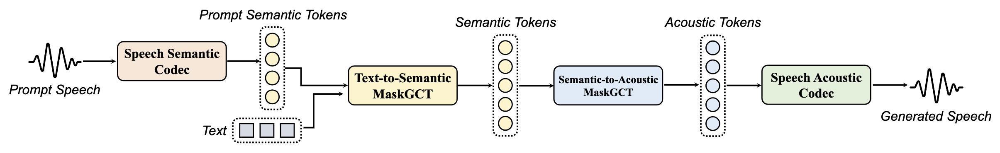

## MaskGCT: Zero-Shot Text-to-Speech with Masked Generative Codec Transformer

[](https://arxiv.org/abs/2409.00750)
[](https://huggingface.co/amphion/maskgct)
[](https://huggingface.co/spaces/amphion/maskgct)
[](https://modelscope.cn/studios/amphion/maskgct)
[](https://modelscope.cn/models/amphion/MaskGCT)
[](../../../models/tts/maskgct/README.md)

Public beta version address 公测版地址: [趣丸千音](https://voice.funnycp.com/)

## Overview

MaskGCT (**Mask**ed **G**enerative **C**odec **T**ransformer) is *a fully non-autoregressive TTS model that eliminates the need for explicit alignment information between text and speech supervision, as well as phone-level duration prediction*. MaskGCT is a two-stage model: in the first stage, the model uses text to predict semantic tokens extracted from a speech self-supervised learning (SSL) model, and in the second stage, the model predicts acoustic tokens conditioned on these semantic tokens. MaskGCT follows the *mask-and-predict* learning paradigm. During training, MaskGCT learns to predict masked semantic or acoustic tokens based on given conditions and prompts. During inference, the model generates tokens of a specified length in a parallel manner. Experiments with 100K hours of in-the-wild speech demonstrate that MaskGCT outperforms the current state-of-the-art zero-shot TTS systems in terms of quality, similarity, and intelligibility. Audio samples are available at [demo page](https://maskgct.github.io/).

<br>
<div align="center">

</div>
<br>

## News

- **2024/10/19**: We release **MaskGCT**, a fully non-autoregressive TTS model that eliminates the need for explicit alignment information between text and speech supervision. MaskGCT is trained on [Emilia](https://huggingface.co/datasets/amphion/Emilia-Dataset) dataset and achieves SOTA zero-shot TTS perfermance.

## Issues

If you encounter any issue when using MaskGCT, feel free to open an issue in this repository. But please use **English** to describe, this will make it easier for keyword searching and more people to participate in the discussion.

## Quickstart

To run this model, you need to follow the steps below:

1. Clone the repository and install the environment.
2. Run the Jupyter notebook / Gradio demo / Inference script.

### Clone and Environment

This parts, follow the steps below to clone the repository and install the environment.

1. Clone the repository, you can choose (a) partial clone or (b) full clone.
2. Install the environment follow guide below.

#### 1. (a) Partial clone

Since the whole Amphion repository is large, you can use sparse-checkout to download only the needed code.

```bash
# download meta info only
git clone --no-checkout --filter=blob:none https://github.com/open-mmlab/Amphion.git

# enter the repositry directory
cd Amphion

# setting sparse-checkout
git sparse-checkout init --cone
git sparse-checkout set models/tts/maskgct

# download the needed code
git checkout main
git sparse-checkout add models/codec utils
```

#### 1. (b) Full clone

If you prefer to download the whole repository, you can use the following command.

```bash
git clone https://github.com/open-mmlab/Amphion.git

# enter the repositry directory
cd Amphion
```

#### 2. Install the environment

Before start installing, making sure you are under the `Amphion` directory. If not, use `cd` to enter.

Since we use `phonemizer` to convert text to phoneme, you need to install `espeak-ng` first. More details can be found [here](https://bootphon.github.io/phonemizer/install.html). Choose the correct installation command according to your operating system:

```bash
# For Debian-like distribution (e.g. Ubuntu, Mint, etc.)
sudo apt-get install espeak-ng
# For RedHat-like distribution (e.g. CentOS, Fedora, etc.) 
sudo yum install espeak-ng

# For Windows
# Please visit https://github.com/espeak-ng/espeak-ng/releases to download .msi installer
```

Now, we are going to install the environment. It is recommended to use conda to configure:

```bash
conda create -n maskgct python=3.10
conda activate maskgct

pip install -r models/tts/maskgct/requirements.txt
```

If no error occurs, the environment is successfully installed. Now, you can choose you preferred way to run the model.

- Run Gradio 🤗 Playground Locally
- Jupyter Notebook
- Inference Script

### Run Gradio 🤗 Playground Locally

You can run the following command to interact with the playground:

```bash
python -m models.tts.maskgct.gradio_demo
```

### Jupyter Notebook

We provide a [Jupyter notebook](../../../models/tts/maskgct/maskgct_demo.ipynb) to show how to use MaskGCT to inference.

You can open this notebook and start running.

### Inference Script

If you do not want to use Juptyer notebook or Gradio, you can use the python inference script.

```bash
python -m models.tts.maskgct.maskgct_inference
```

Running this will automatically download the pretrained model from HuggingFace and start the inference process. The result audio is by default saved in `generated_audio.wav`, you can change this in the [script](../../../models/tts/maskgct/maskgct_inference.py).

## Model Introduction

We provide the following pretrained checkpoints:


| Model Name          | Description   |    
|-------------------|-------------|
| [Semantic Codec](https://huggingface.co/amphion/MaskGCT/tree/main/semantic_codec)      | Converting speech to semantic tokens. |
| [Acoustic Codec](https://huggingface.co/amphion/MaskGCT/tree/main/acoustic_codec)      | Converting speech to acoustic tokens and reconstructing waveform from acoustic tokens. |
| [MaskGCT-T2S](https://huggingface.co/amphion/MaskGCT/tree/main/t2s_model)         | Predicting semantic tokens with text and prompt semantic tokens.             |
| [MaskGCT-S2A](https://huggingface.co/amphion/MaskGCT/tree/main/s2a_model)         | Predicts acoustic tokens conditioned on semantic tokens.              |

You can download all pretrained checkpoints from [HuggingFace](https://huggingface.co/amphion/MaskGCT/tree/main) or use huggingface API.

```python
from huggingface_hub import hf_hub_download

# download semantic codec ckpt
semantic_code_ckpt = hf_hub_download("amphion/MaskGCT", filename="semantic_codec/model.safetensors")

# same for other models
```

By running the Jupyter/Gradio/inference script, it will automatically download the pretrained model from HuggingFace.

If you having trouble connecting to HuggingFace, you try switch endpoint to mirror site:

```bash
export HF_ENDPOINT=https://hf-mirror.com
```

## Training Dataset

We use the [Emilia](https://huggingface.co/datasets/amphion/Emilia-Dataset) dataset to train our models. Emilia is a multilingual and diverse in-the-wild speech dataset designed for large-scale speech generation. In this work, we use English and Chinese data from Emilia, each with 50K hours of speech (totaling 100K hours).


## Evaluation Results of MaskGCT

| System | SIM-O↑ | WER↓ | FSD↓ | SMOS↑ | CMOS↑ |
| :--- | :---: | :---: | :---: | :---: | :---: |
| | | **LibriSpeech test-clean** |
| Ground Truth | 0.68 | 1.94 |  | 4.05±0.12 | 0.00 |
| VALL-E | 0.50 | 5.90 | - | 3.47 ±0.26 | -0.52±0.22 |
| VoiceBox | 0.64 | 2.03 | 0.762 | 3.80±0.17 | -0.41±0.13 |
| NaturalSpeech 3 | 0.67 | 1.94 | 0.786 | 4.26±0.10 | 0.16±0.14 |
| VoiceCraft | 0.45 | 4.68 | 0.981 | 3.52±0.21 | -0.33 ±0.16 |
| XTTS-v2 | 0.51 | 4.20 | 0.945 | 3.02±0.22 | -0.98 ±0.19 |
| MaskGCT | 0.687(0.723) | 2.634(1.976) | 0.886 | 4.27±0.14 | 0.10±0.16 |
| MaskGCT(gt length) | 0.697 | 2.012 | 0.746 | 4.33±0.11 | 0.13±0.13 |
| | | **SeedTTS test-en** |
| Ground Truth | 0.730 | 2.143 |  | 3.92±0.15 | 0.00 |
| CosyVoice | 0.643 | 4.079 | 0.316 | 3.52±0.17 | -0.41 ±0.18 |
| XTTS-v2 | 0.463 | 3.248 | 0.484 | 3.15±0.22 | -0.86±0.19 |
| VoiceCraft | 0.470 | 7.556 | 0.226 | 3.18±0.20 | -1.08 ±0.15 |
| MaskGCT | 0.717(0.760) | 2.623(1.283) | 0.188 | 4.24 ±0.12 | 0.03 ±0.14 |
| MaskGCT(gt length) | 0.728 | 2.466 | 0.159 | 4.13 ±0.17 | 0.12 ±0.15 |
| | | **SeedTTS test-zh** |
| Ground Truth | 0.750 | 1.254 |  | 3.86 ±0.17 | 0.00 |
| CosyVoice | 0.750 | 4.089 | 0.276 | 3.54 ±0.12 | -0.45 ±0.15 |
| XTTS-v2 | 0.635 | 2.876 | 0.413 | 2.95 ±0.18 | -0.81 ±0.22 |
| MaskGCT | 0.774(0.805) | 2.273(0.843) | 0.106 | 4.09 ±0.12 | 0.05 ±0.17 |
| MaskGCT(gt length) | 0.777 | 2.183 | 0.101 | 4.11 ±0.12 | 0.08±0.18 |

## Citations

If you use MaskGCT in your research, please cite the following paper:

```bibtex
@article{wang2024maskgct,
  title={MaskGCT: Zero-Shot Text-to-Speech with Masked Generative Codec Transformer},
  author={Wang, Yuancheng and Zhan, Haoyue and Liu, Liwei and Zeng, Ruihong and Guo, Haotian and Zheng, Jiachen and Zhang, Qiang and Zhang, Xueyao and Zhang, Shunsi and Wu, Zhizheng},
  journal={arXiv preprint arXiv:2409.00750},
  year={2024}
}

@inproceedings{amphion,
    author={Zhang, Xueyao and Xue, Liumeng and Gu, Yicheng and Wang, Yuancheng and Li, Jiaqi and He, Haorui and Wang, Chaoren and Song, Ting and Chen, Xi and Fang, Zihao and Chen, Haopeng and Zhang, Junan and Tang, Tze Ying and Zou, Lexiao and Wang, Mingxuan and Han, Jun and Chen, Kai and Li, Haizhou and Wu, Zhizheng},
    title={Amphion: An Open-Source Audio, Music and Speech Generation Toolkit},
    booktitle={{IEEE} Spoken Language Technology Workshop, {SLT} 2024},
    year={2024}
}
```
