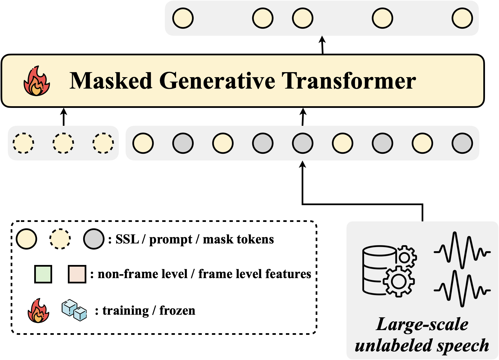
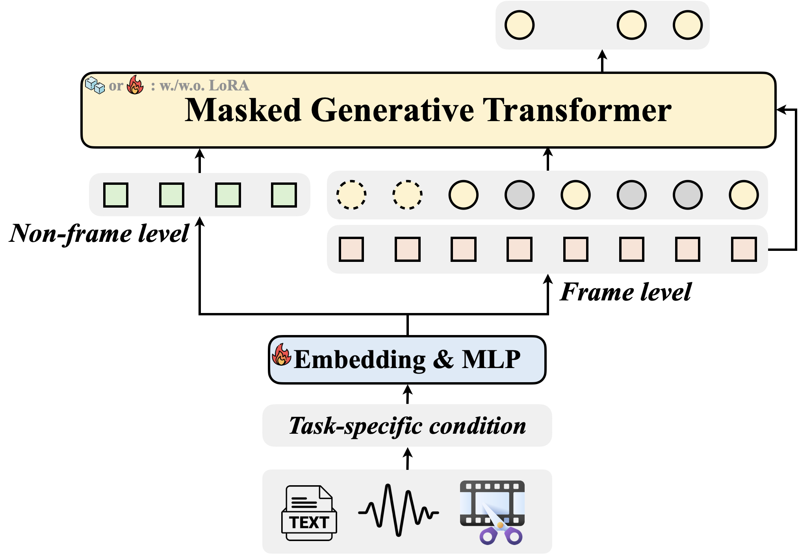

# *Metis*: A Foundation Speech Generation Model with Masked Generative Pre-training

[](https://arxiv.org/pdf/2502.03128)
[](../../../models/tts/metis/README.md)
[](https://huggingface.co/amphion/metis)
[](https://modelscope.cn/models/amphion/metis)

<!-- [](https://huggingface.co/spaces/amphion/metis) -->
<!-- [](https://modelscope.cn/studios/amphion/metis) -->

## Overview

We introduce ***Metis***, a foundation model for unified speech generation.
Unlike previous task-specific or multi-task models, Metis follows a pre-training and fine-tuning paradigm. It is pre-trained on large-scale unlabeled speech data using masked generative modeling and then fine-tuned to adapt to diverse speech generation tasks.
Specifically, (1) Metis utilizes two discrete speech representations: SSL tokens derived from speech self-supervised learning (SSL) features, and acoustic tokens directly quantized from waveforms. (2) Metis performs masked generative pre-training on SSL tokens, utilizing 300K hours of diverse speech data, without any additional condition. (3) Through fine-tuning with task-specific conditions, Metis achieves efficient adaptation to various speech generation tasks while supporting multimodal input, even when using limited data and trainable parameters.
Experiments demonstrate that Metis can serve as a foundation model for unified speech generation: Metis outperforms state-of-the-art task-specific or multi-task systems
across five speech generation tasks, including zero-shot text-to-speech, voice conversion, target speaker extraction, speech enhancement, and lip-to-speech, even with fewer than 20M trainable parameters or 300 times less training data.
Audio samples are available at [demo page](https://metis-demo.github.io/).


<div align="center">
  
  
</div>
<div align="center">
  <p><i>Pre-training (left) and fine-tuning (right).</i></p>
</div>

## News

- **2025/02/26**: We release ***Metis***, a foundation model for unified speech generation. The system supports zero-shot text-to-speech, voice conversion, target speaker extraction, speech enhancement, and lip-to-speech.


<!-- ## Todo List

- [ ] Add inference code for lip2speech -->


## Model Introduction

Metis is fully compatible with MaskGCT and shares several key model components with it. These shared components are:


| Model Name                                                                        | Description                                                                            |
| --------------------------------------------------------------------------------- | -------------------------------------------------------------------------------------- |
| [Semantic Codec](https://huggingface.co/amphion/MaskGCT/tree/main/semantic_codec) | Converting speech to semantic tokens.                                                  |
| [Acoustic Codec](https://huggingface.co/amphion/MaskGCT/tree/main/acoustic_codec) | Converting speech to acoustic tokens and reconstructing waveform from acoustic tokens. |
| [Semantic2Acoustic](https://huggingface.co/amphion/MaskGCT/tree/main/s2a_model)         | Predicts acoustic tokens conditioned on semantic tokens.    |
<!-- | [MaskGCT-T2S](https://huggingface.co/amphion/MaskGCT/tree/main/t2s_model)         | Predicting semantic tokens with text and prompt semantic tokens.                       | -->

We open-source the pretrained model checkpoint of the first stage of Metis (with masked generative pre-training), as well as the fine-tuned models for speech enhancement (SE), target speaker extraction (TSE), voice conversion (VC), lip-to-speech (L2S), and the unified multi-task (Omni) model.

For zero-shot text-to-speech, you can download the text2semantic model from MaskGCT, which is compatible with the Metis framework.

| Model Name | Description |
| --- | --- |
| [Metis-Base](https://huggingface.co/amphion/metis/tree/main/metis_base) | The base model pre-trained with masked generative pre-training. |
| [Metis-TSE](https://huggingface.co/amphion/metis/tree/main/metis_tse) | Fine-tuned model for target speaker extraction. Available in both full-scale and LoRA ($r = 32$) versions. |
| [Metis-VC](https://huggingface.co/amphion/metis/tree/main/metis_vc) | Fine-tuned model for voice conversion. Available in full-scale version. |
| [Metis-SE](https://huggingface.co/amphion/metis/tree/main/metis_se) | Fine-tuned model for speech enhancement. Available in both full-scale and LoRA ($r = 32$) versions. |
| [Metis-L2S](https://huggingface.co/amphion/metis/tree/main/metis_l2s) | Fine-tuned model for lip-to-speech. Available in full-scale version. |
| [Metis-TTS](https://huggingface.co/amphion/MaskGCT/tree/main/t2s_model) | Zero-shot text-to-speech model (as same as the first stage of MaskGCT). |
| [Metis-Omni](https://huggingface.co/amphion/metis/tree/main/metis_omni) | Unified multi-task model supporting zero-shot TTS, VC, TSE, and SE. |


## Usage

To run this model, you need to follow the steps below:

1. Clone the repository and install the environment.
2. Run the Inference script.
   
### Clone and Environment

#### 1. Clone the repository

```bash
git clone https://github.com/open-mmlab/Amphion.git
cd Amphion
```
#### 2. Install the environment

Before start installing, making sure you are under the `Amphion` directory. If not, use `cd` to enter.

Since we use `phonemizer` to convert text to phoneme, you need to install `espeak-ng` first. More details can be found [here](https://bootphon.github.io/phonemizer/install.html). Choose the correct installation command according to your operating system:

```bash
# For Debian-like distribution (e.g. Ubuntu, Mint, etc.)
sudo apt-get install espeak-ng
# For RedHat-like distribution (e.g. CentOS, Fedora, etc.) 
sudo yum install espeak-ng

# For Windows
# Please visit https://github.com/espeak-ng/espeak-ng/releases to download .msi installer
```

**The environment used for Metis is the same as the one used for MaskGCT.**

Now, we are going to install the environment. It is recommended to use conda to configure:

```bash
conda create -n maskgct python=3.10
conda activate maskgct

pip install -r models/tts/maskgct/requirements.txt
```

### Inference

#### 1. Inference Script

```bash
# Metis TSE
python -m models.tts.metis.metis_infer_tse

# Metis SE
python -m models.tts.metis.metis_infer_se

# Metis VC
python -m models.tts.metis.metis_infer_vc

# Metis Lip2Speech
python -m models.tts.metis.metis_infer_l2s
```

You can also use a similar framework for inference with MaskGCT:

```bash
# Metis TTS (MaskGCT)
python -m models.tts.maskgct.maskgct_infer_tts
```

You can also use only one model (Metis-Omni) to infer TTS, VC, TSE, and SE tasks.

```bash
# Metis Omni
python -m models.tts.metis.metis_infer_omni
```

Running this will automatically download the pretrained model from HuggingFace and start the inference process. We provide example audio files for inference. Please see the scripts for more details and parameter configurations.


#### 2. Example Usaage

Take Metis-TSE for example, the inference script first downloads the model checkpoints:

```python
# download base model, lora weights, and adapter weights
base_ckpt_dir = snapshot_download(
    "amphion/metis",
    repo_type="model",
    local_dir="./models/tts/metis/ckpt",
    allow_patterns=["metis_base/model.safetensors"],
)
lora_ckpt_dir = snapshot_download(
    "amphion/metis",
    repo_type="model",
    local_dir="./models/tts/metis/ckpt",
    allow_patterns=["metis_tse/metis_tse_lora_32.safetensors"],
)
adapter_ckpt_dir = snapshot_download(
    "amphion/metis",
    repo_type="model",
    local_dir="./models/tts/metis/ckpt",
    allow_patterns=["metis_tse/metis_tse_lora_32_adapter.safetensors"],
)
```

Then, the script will load the model checkpoints and initialize the fine-tined Metis model:

```python
base_ckpt_path = os.path.join(base_ckpt_dir, "metis_base/model.safetensors")
lora_ckpt_path = os.path.join(
    lora_ckpt_dir, "metis_tse/metis_tse_lora_32.safetensors"
)
adapter_ckpt_path = os.path.join(
    adapter_ckpt_dir, "metis_tse/metis_tse_lora_32_adapter.safetensors"
)

metis = Metis(
    base_ckpt_path=base_ckpt_path,
    lora_ckpt_path=lora_ckpt_path,
    adapter_ckpt_path=adapter_ckpt_path,
    cfg=metis_cfg,
    device=device,
    model_type="tse",
)
```

Finally, the script will generate the speech and save it to the `models/tts/metis/wav/tse/gen.wav` directory, you can change this in the script.

```python
prompt_speech_path = "./models/tts/metis/wav/tse/prompt.wav"
source_speech_path = "./models/tts/metis/wav/tse/mix.wav"

n_timesteps = 10
cfg = 0.0

gen_speech = metis(
    prompt_speech_path=prompt_speech_path,
    source_speech_path=source_speech_path,
    cfg=cfg,
    n_timesteps=n_timesteps,
    model_type="tse",
)

sf.write("./models/tts/metis/wav/tse/gen.wav", gen_speech, 24000)
```

## Citations 

If you use Metis in your research, please cite the following paper:

```bibtex
@article{wang2025metis,
  title={Metis: A Foundation Speech Generation Model with Masked Generative Pre-training},
  author={Wang, Yuancheng and Zheng, Jiachen and Zhang, Junan and Zhang, Xueyao and Liao, Huan and Wu, Zhizheng},
  journal={arXiv preprint arXiv:2502.03128},
  year={2025}
}
@inproceedings{wang2024maskgct,
  author={Wang, Yuancheng and Zhan, Haoyue and Liu, Liwei and Zeng, Ruihong and Guo, Haotian and Zheng, Jiachen and Zhang, Qiang and Zhang, Xueyao and Zhang, Shunsi and Wu, Zhizheng},
  title={MaskGCT: Zero-Shot Text-to-Speech with Masked Generative Codec Transformer},
  booktitle    = {{ICLR}},
  publisher    = {OpenReview.net},
  year         = {2025}
}
@article{amphion_v0.2,
  title        = {Overview of the Amphion Toolkit (v0.2)},
  author       = {Jiaqi Li and Xueyao Zhang and Yuancheng Wang and Haorui He and Chaoren Wang and Li Wang and Huan Liao and Junyi Ao and Zeyu Xie and Yiqiao Huang and Junan Zhang and Zhizheng Wu},
  year         = {2025},
  journal      = {arXiv preprint arXiv:2501.15442},
}
@inproceedings{amphion,
    author={Zhang, Xueyao and Xue, Liumeng and Gu, Yicheng and Wang, Yuancheng and Li, Jiaqi and He, Haorui and Wang, Chaoren and Song, Ting and Chen, Xi and Fang, Zihao and Chen, Haopeng and Zhang, Junan and Tang, Tze Ying and Zou, Lexiao and Wang, Mingxuan and Han, Jun and Chen, Kai and Li, Haizhou and Wu, Zhizheng},
    title={Amphion: An Open-Source Audio, Music and Speech Generation Toolkit},
    booktitle={{IEEE} Spoken Language Technology Workshop, {SLT} 2024},
    year={2024}
}
```
